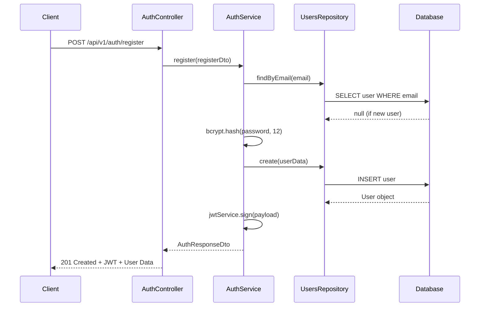
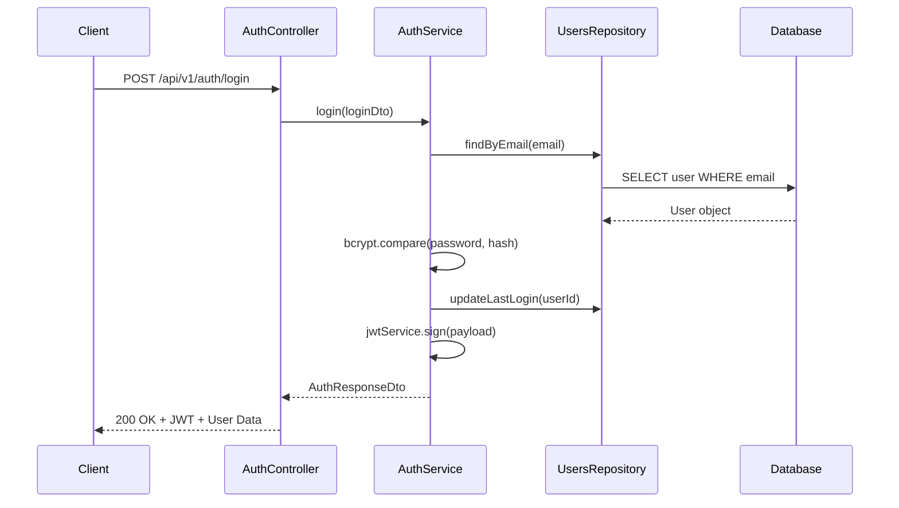
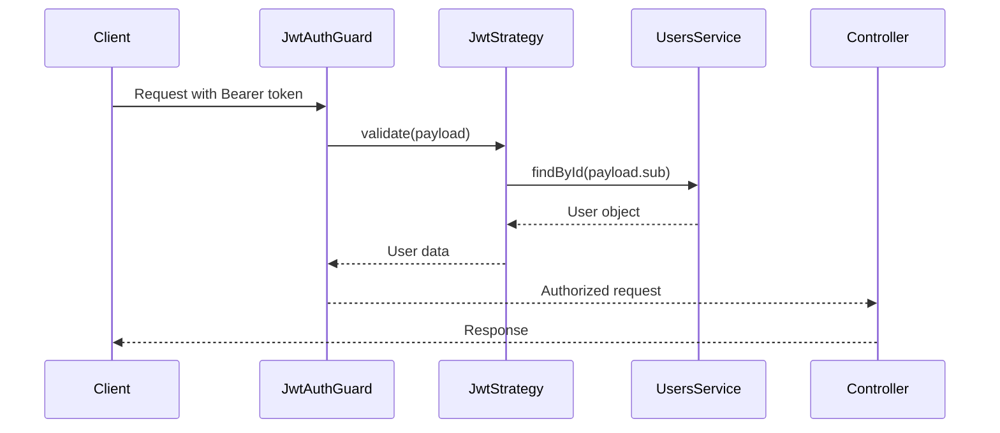

# Authentication System Documentation

## Overview

This document provides comprehensive documentation for the authentication system in the Trend Backend API. The system is built using NestJS with JWT-based authentication, bcrypt password hashing, and PostgreSQL for data persistence.

## Table of Contents

1. [Authentication Architecture](#authentication-architecture)
2. [Security Implementation](#security-implementation)
3. [Authentication Flow](#authentication-flow)
4. [JWT Implementation](#jwt-implementation)
5. [Password Security](#password-security)
6. [API Endpoints](#api-endpoints)
7. [Security Middleware and Guards](#security-middleware-and-guards)
8. [Data Models](#data-models)
9. [Error Handling](#error-handling)
10. [Security Best Practices](#security-best-practices)
11. [Token Management](#token-management)

## Authentication Architecture

### Core Components

The authentication system consists of several key components:

- **AuthModule** (`/src/auth/auth.module.ts`): Central module managing authentication dependencies
- **AuthService** (`/src/auth/auth.service.ts`): Business logic for authentication operations
- **AuthController** (`/src/auth/auth.controller.ts`): HTTP endpoints for authentication
- **JwtStrategy** (`/src/auth/strategies/jwt.strategy.ts`): Passport JWT strategy implementation
- **JwtAuthGuard** (`/src/auth/guards/jwt-auth.guard.ts`): Route protection guard
- **UsersRepository** (`/src/users/repositories/users.repository.ts`): Database operations for users

### Module Dependencies

```typescript
@Module({
  imports: [
    JwtModule.register({
      secret: process.env.JWT_SECRET || "your-secret-key",
      signOptions: { expiresIn: "7d" },
    }),
    UsersModule,
  ],
  controllers: [AuthController],
  providers: [AuthService, JwtStrategy],
  exports: [AuthService],
})
```

## Security Implementation

### Environment Configuration

- **JWT Secret**: Configurable via `JWT_SECRET` environment variable
- **Database**: PostgreSQL with connection pooling
- **CORS**: Enabled for cross-origin requests
- **Rate Limiting**: Configured via ThrottlerModule (100 requests per 60 seconds)

### Global Security Settings

```typescript
// Global validation pipe with security features
app.useGlobalPipes(
  new ValidationPipe({
    whitelist: true,    // Remove non-whitelisted properties
    transform: true,    // Auto-transform payloads
  })
);
```

## Authentication Flow

### 1. User Registration Flow



### 2. User Login Flow



### 3. Protected Route Access



## JWT Implementation

### JWT Configuration

- **Algorithm**: HS256 (HMAC with SHA-256)
- **Expiration**: 7 days (`7d`)
- **Secret**: Environment variable `JWT_SECRET`
- **Extraction**: Bearer token from Authorization header

### JWT Payload Structure

```typescript
interface JwtPayload {
  sub: string;        // User ID (subject)
  email: string;      // User email
  username?: string;  // Optional username
  iat?: number;       // Issued at timestamp
  exp?: number;       // Expiration timestamp
}
```

### JWT Strategy Implementation

```typescript
@Injectable()
export class JwtStrategy extends PassportStrategy(Strategy) {
  constructor(private usersService: UsersService) {
    super({
      jwtFromRequest: ExtractJwt.fromAuthHeaderAsBearerToken(),
      ignoreExpiration: false,
      secretOrKey: process.env.JWT_SECRET || "your-secret-key",
    });
  }

  async validate(payload: JwtPayload) {
    const user = await this.usersService.findById(payload.sub);
    if (!user || !user.isActive) {
      throw new UnauthorizedException("User not found or inactive");
    }
    return user; // Attached to request.user
  }
}
```

### Token Generation

```typescript
const payload = {
  sub: user.id,
  email: user.email,
  username: user.username,
};
const access_token = this.jwtService.sign(payload);
```

## Password Security

### Hashing Implementation

- **Library**: bcryptjs
- **Salt Rounds**: 12 (high security level)
- **Hash Storage**: `passwordHash` field in database

### Password Hashing Process

```typescript
// Registration - Hash password
const saltRounds = 12;
const passwordHash = await bcrypt.hash(registerDto.password, saltRounds);

// Login - Verify password
const isPasswordValid = await bcrypt.compare(
  loginDto.password,
  user.passwordHash || ""
);
```

### Security Features

- **Salt Rounds**: 12 rounds provide strong protection against rainbow table attacks
- **Automatic Salting**: bcrypt automatically generates unique salts
- **Time-Constant Comparison**: bcrypt.compare prevents timing attacks

## API Endpoints

### Public Endpoints

#### POST /api/v1/auth/register

Registers a new user account.

**Request Body:**
```json
{
  "email": "user@example.com",
  "firstName": "John",
  "lastName": "Doe",
  "password": "securePassword123",
  "username": "johndoe", // Optional
  "currency": "USD", // Optional, defaults to USD
  "timezone": "UTC" // Optional, defaults to UTC
}
```

**Response (201 Created):**
```json
{
  "access_token": "eyJhbGciOiJIUzI1NiIsInR5cCI6IkpXVCJ9...",
  "user": {
    "id": "cmbziufnk0000inr580373r7p8",
    "email": "user@example.com",
    "firstName": "John",
    "lastName": "Doe",
    "username": "johndoe",
    "currency": "USD",
    "timezone": "UTC",
    "createdAt": "2024-01-15T10:30:00.000Z",
    "income": null,
    "setupComplete": false,
    "hasSeenBalanceCardTour": false,
    "hasSeenAddTransactionTour": false,
    "hasSeenTransactionSwipeTour": false
  }
}
```

**Error Responses:**
- `409 Conflict`: User with email already exists
- `409 Conflict`: Username already taken
- `400 Bad Request`: Validation errors

#### POST /api/v1/auth/login

Authenticates a user and returns a JWT token.

**Request Body:**
```json
{
  "email": "user@example.com",
  "password": "securePassword123"
}
```

**Response (200 OK):**
```json
{
  "access_token": "eyJhbGciOiJIUzI1NiIsInR5cCI6IkpXVCJ9...",
  "user": {
    "id": "cmbziufnk0000inr580373r7p8",
    "email": "user@example.com",
    "firstName": "John",
    "lastName": "Doe",
    "username": "johndoe",
    "currency": "USD",
    "timezone": "UTC",
    "createdAt": "2024-01-15T10:30:00.000Z",
    "income": 50000,
    "setupComplete": true,
    "hasSeenBalanceCardTour": true,
    "hasSeenAddTransactionTour": false,
    "hasSeenTransactionSwipeTour": false
  }
}
```

**Error Responses:**
- `401 Unauthorized`: Invalid credentials
- `401 Unauthorized`: User account inactive

### Protected Endpoints

#### GET /api/v1/auth/profile

Retrieves the authenticated user's profile.

**Headers:**
```
Authorization: Bearer <jwt_token>
```

**Response (200 OK):**
```json
{
  "id": "cmbziufnk0000inr580373r7p8",
  "email": "user@example.com",
  "firstName": "John",
  "lastName": "Doe",
  "username": "johndoe",
  "currency": "USD",
  "timezone": "UTC",
  "isActive": true,
  "createdAt": "2024-01-15T10:30:00.000Z",
  "updatedAt": "2024-01-15T11:45:00.000Z",
  "income": 50000,
  "setupComplete": true,
  "hasSeenWelcome": true,
  "hasSeenBalanceCardTour": true,
  "hasSeenAddTransactionTour": false,
  "hasSeenTransactionSwipeTour": false
}
```

#### PUT /api/v1/auth/profile

Updates the authenticated user's profile.

**Headers:**
```
Authorization: Bearer <jwt_token>
```

**Request Body (all fields optional):**
```json
{
  "firstName": "John",
  "lastName": "Smith",
  "username": "johnsmith",
  "currency": "EUR",
  "timezone": "Europe/London",
  "income": 60000,
  "setupComplete": true,
  "hasSeenWelcome": true,
  "hasSeenBalanceCardTour": true,
  "hasSeenAddTransactionTour": true,
  "hasSeenTransactionSwipeTour": true
}
```

**Response (200 OK):**
```json
{
  "id": "cmbziufnk0000inr580373r7p8",
  "email": "user@example.com",
  "firstName": "John",
  "lastName": "Smith",
  "username": "johnsmith",
  "currency": "EUR",
  "timezone": "Europe/London",
  "isActive": true,
  "createdAt": "2024-01-15T10:30:00.000Z",
  "updatedAt": "2024-01-15T12:00:00.000Z",
  "income": 60000,
  "setupComplete": true,
  "hasSeenWelcome": true,
  "hasSeenBalanceCardTour": true,
  "hasSeenAddTransactionTour": true,
  "hasSeenTransactionSwipeTour": true
}
```

## Security Middleware and Guards

### JwtAuthGuard

The `JwtAuthGuard` extends NestJS's `AuthGuard` and provides:

- **Token Extraction**: Automatically extracts JWT from Authorization header
- **Token Validation**: Verifies token signature and expiration
- **User Validation**: Ensures user exists and is active
- **Request Enhancement**: Adds user object to request context

```typescript
@Injectable()
export class JwtAuthGuard extends AuthGuard("jwt") {
  canActivate(context: ExecutionContext) {
    return super.canActivate(context);
  }

  handleRequest(err: any, user: any, info: any) {
    if (err || !user) {
      throw err || new UnauthorizedException("Invalid token");
    }
    return user;
  }
}
```

### Guard Usage Patterns

#### Controller-Level Protection
```typescript
@Controller("users")
@UseGuards(JwtAuthGuard) // Protects all endpoints
export class UsersController {
  // All methods require authentication
}
```

#### Method-Level Protection
```typescript
@Get("profile")
@UseGuards(JwtAuthGuard) // Protects specific endpoint
async getProfile(@Request() req) {
  return this.authService.getUserProfile(req.user.id);
}
```

### Rate Limiting

Global rate limiting is configured using ThrottlerModule:

```typescript
ThrottlerModule.forRoot([
  {
    ttl: 60000,  // 60 seconds
    limit: 100,  // 100 requests per TTL
  },
])
```

## Data Models

### User Model (Prisma Schema)

```prisma
model User {
  id             String        @id @default(cuid())
  email          String        @unique
  username       String?       @unique
  firstName      String
  lastName       String
  passwordHash   String?
  currency       String        @default("USD")
  timezone       String        @default("UTC")
  createdAt      DateTime      @default(now())
  updatedAt      DateTime      @updatedAt
  isActive       Boolean       @default(true)
  
  // User setup fields
  income         Decimal?      @db.Decimal(12, 2)
  setupComplete  Boolean       @default(false)
  hasSeenWelcome Boolean       @default(false)
  
  // Tutorial onboarding fields
  hasSeenBalanceCardTour     Boolean @default(false)
  hasSeenAddTransactionTour   Boolean @default(false)
  hasSeenTransactionSwipeTour Boolean @default(false)
  
  // Relations
  budgets        Budget[]
  categories     Category[]
  transactions   Transaction[]

  @@map("users")
}
```

### Data Transfer Objects (DTOs)

#### RegisterDto
```typescript
export class RegisterDto {
  email: string;
  firstName: string;
  lastName: string;
  password: string;
  username?: string;
  currency?: string;
  timezone?: string;
}
```

#### LoginDto
```typescript
export class LoginDto {
  email: string;
  password: string;
}
```

#### UpdateUserProfileDto
```typescript
export class UpdateUserProfileDto {
  @IsOptional()
  @IsString()
  @MaxLength(50)
  firstName?: string;

  @IsOptional()
  @IsString()
  @MaxLength(50)
  lastName?: string;

  @IsOptional()
  @IsString()
  @MaxLength(30)
  username?: string;

  @IsOptional()
  @IsString()
  @MaxLength(10)
  currency?: string;

  @IsOptional()
  @IsString()
  timezone?: string;

  @IsOptional()
  @IsNumber()
  @Min(0)
  income?: number;

  @IsOptional()
  @IsBoolean()
  setupComplete?: boolean;

  @IsOptional()
  @IsBoolean()
  hasSeenWelcome?: boolean;

  @IsOptional()
  @IsBoolean()
  hasSeenBalanceCardTour?: boolean;

  @IsOptional()
  @IsBoolean()
  hasSeenAddTransactionTour?: boolean;

  @IsOptional()
  @IsBoolean()
  hasSeenTransactionSwipeTour?: boolean;
}
```

#### AuthResponseDto
```typescript
export class AuthResponseDto {
  access_token: string;
  user: {
    id: string;
    email: string;
    firstName: string;
    lastName: string;
    username: string | null;
    currency: string;
    timezone: string;
    createdAt: Date;
    income: number | null;
    setupComplete: boolean;
    hasSeenBalanceCardTour: boolean;
    hasSeenAddTransactionTour: boolean;
    hasSeenTransactionSwipeTour: boolean;
  };
}
```

## Error Handling

### Authentication Errors

#### 401 Unauthorized
- **Invalid credentials**: Wrong email/password combination
- **Invalid token**: Malformed, expired, or invalid JWT
- **User not found**: User doesn't exist or is inactive
- **Token missing**: No Authorization header provided

#### 409 Conflict
- **Email exists**: User with email already registered
- **Username taken**: Username already in use by another user

#### 400 Bad Request
- **Validation errors**: DTO validation failures
- **Missing required fields**: Required registration/login fields missing

### Error Response Format

```json
{
  "statusCode": 401,
  "message": "Invalid credentials",
  "error": "Unauthorized"
}
```

### Logging

The authentication service includes comprehensive logging:

```typescript
// Registration logging
console.log("📝 Registration attempt for:", registerDto.email);
console.log("🔐 Hashing password...");
console.log("👤 Creating user...");
console.log("🎫 Generating JWT token...");
console.log("✅ Registration successful for:", user.email);

// Login logging
console.log("🔐 Login attempt for:", loginDto.email);
console.log("👤 Looking up user...");
console.log("🔑 Verifying password...");
console.log("📅 Updating last login...");
console.log("✅ Login successful for:", user.email);
```

## Security Best Practices

### Implemented Security Measures

1. **Password Security**
   - Bcrypt with 12 salt rounds
   - Passwords never stored in plaintext
   - Time-constant password comparison

2. **JWT Security**
   - Strong secret key (environment variable)
   - 7-day expiration
   - Bearer token authentication
   - Token validation on each request

3. **Input Validation**
   - Global validation pipe
   - DTO-based validation with class-validator
   - Whitelist mode (removes extra properties)
   - Type transformation

4. **Database Security**
   - Prepared statements via Prisma
   - SQL injection protection
   - Connection pooling
   - Error handling without data exposure

5. **Rate Limiting**
   - 100 requests per 60 seconds globally
   - Prevents brute force attacks

6. **CORS Configuration**
   - Enabled for cross-origin requests
   - Configurable origins

7. **User Management**
   - Soft delete via `isActive` flag
   - Unique email and username constraints
   - Automatic timestamp tracking

### Recommended Additional Security Measures

1. **Enhanced JWT Security**
   - Implement refresh tokens
   - Add token blacklisting
   - Use shorter access token expiration
   - Implement token rotation

2. **Password Policy**
   - Minimum password length
   - Password complexity requirements
   - Password history prevention

3. **Two-Factor Authentication**
   - TOTP support
   - SMS/Email verification
   - Backup codes

4. **Advanced Rate Limiting**
   - User-specific rate limits
   - Endpoint-specific limits
   - Progressive delays

5. **Security Headers**
   - Helmet.js integration
   - CSP headers
   - HSTS headers

6. **Audit Logging**
   - Security event logging
   - Failed authentication tracking
   - IP address logging

## Token Management

### Token Lifecycle

1. **Generation**: JWT created upon successful login/registration
2. **Storage**: Client stores token (localStorage/secure storage)
3. **Usage**: Token sent in Authorization header
4. **Validation**: Server validates on each protected request
5. **Expiration**: Token expires after 7 days

### Token Usage Example

```javascript
// Client-side token usage
const token = localStorage.getItem('access_token');

fetch('/api/v1/auth/profile', {
  headers: {
    'Authorization': `Bearer ${token}`,
    'Content-Type': 'application/json'
  }
})
.then(response => response.json())
.then(data => console.log(data));
```

### Token Validation Process

1. Extract token from Authorization header
2. Verify JWT signature using secret key
3. Check token expiration
4. Extract user ID from payload
5. Validate user exists and is active
6. Attach user object to request context

### Token Security Considerations

- **Storage**: Use secure storage on client side
- **Transmission**: Always use HTTPS in production
- **Expiration**: 7-day expiration balances security and UX
- **Scope**: Tokens carry minimal user information
- **Invalidation**: User deactivation invalidates all tokens

## Conclusion

This authentication system provides a robust, secure foundation for the Trend Backend API. It implements industry-standard security practices including JWT authentication, bcrypt password hashing, comprehensive input validation, and rate limiting. The modular design allows for easy extension and maintenance while ensuring security best practices are followed throughout the application.

For any questions or security concerns, please refer to the source code or consult with the development team.